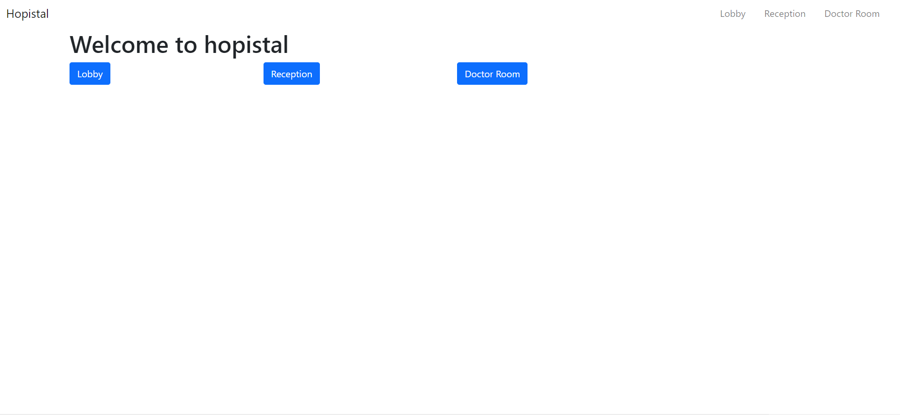

# Hospital Mangagement


> This is small project for simulating hospital management application.

> Patient -> Lobby -> Reception -> Doctor : when a patient is moved to hospital, they need to register information (name, age, disease, ...), then they will wait until being moved to reception. In reception, patient will be arranged to meet a suitable doctor. The order of patient is based on the seriousness of the disease.

## Preview


### ✨ [Demo](https://polar-meadow-52809.herokuapp.com/)

## Run

```sh
npm install
```
```sh
npm start
```

## Author

👤 **hoangtrung1801**

* Github: [@hoangtrung1801](https://github.com/hoangtrung1801)

## Show your support

Give a ⭐️ if this project helped you!


***
_This README was generated with ❤️ by [readme-md-generator](https://github.com/kefranabg/readme-md-generator)_